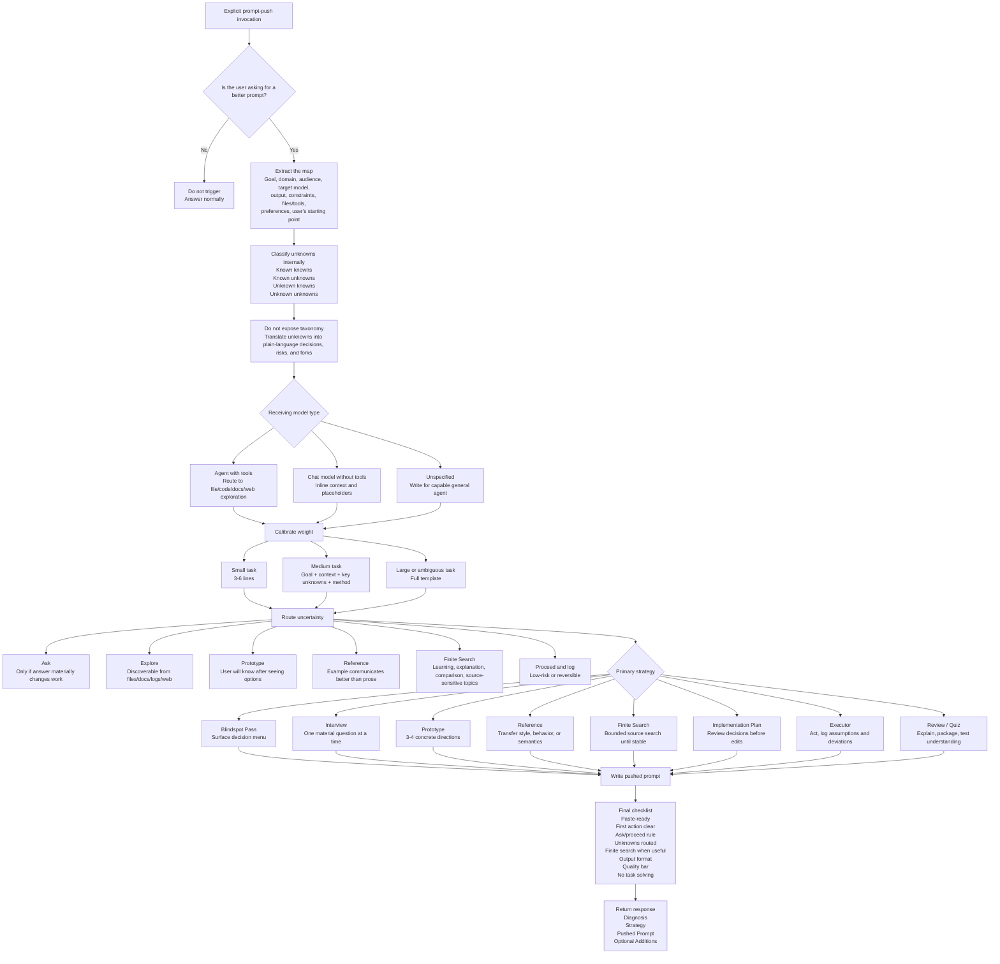
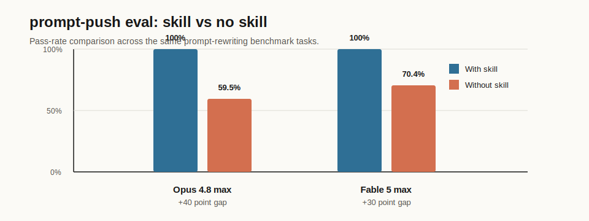

# Thariq's X article Prompt Skill: Finding Unknowns for Fable 5

This repository contains `prompt-push`, a skill inspired by Thariq's X article, [A Field Guide to Fable: Finding Your Unknowns](https://x.com/trq212/article/2073100352921215386).

The article's central idea is simple and powerful: prompts are the map, real work is the territory, and the gap between them is made of unknowns. `prompt-push` turns that idea into a practical skill for rewriting rough user intent into a stronger prompt for another LLM or coding agent.

## What This Skill Does

`prompt-push` does not solve the user's task directly. It produces a better prompt for the next model.

Use it when you explicitly want to turn a rough prompt into a sharper, ready-to-paste prompt for an LLM or agent. The skill:

- extracts the actual goal, context, constraints, and target model
- classifies unknowns internally
- decides whether the next model should ask, explore, prototype, reference, proceed, or search finitely
- calibrates prompt size to task size
- produces a prompt with a clear working method, output format, and quality bar

## Why It Exists

Thariq's article frames agentic work around a recurring failure mode: the model is forced to make decisions inside gaps the user did not know to clarify.

Those gaps show up as:

- **Known knowns**: what the user already said
- **Known unknowns**: open questions the user can see
- **Unknown knowns**: taste, preferences, or standards the user may recognize only after seeing options
- **Unknown unknowns**: hidden constraints, risks, or better approaches the user has not considered

`prompt-push` helps the next model handle those gaps deliberately instead of guessing through them.

## Skill Diagram

rough prompt = map → real task = territory → unknowns = gap → pushed prompt = instructions that make the next model handle the gap deliberately.



## Finite Search Behavior

For learning, explanation, comparison, "what is X", and source-sensitive information tasks, the skill pushes the receiving model to search deeply but finitely.

It should not ask for infinite search or "search until the bottom." Instead, it asks the model to:

- check a bounded set of high-quality sources
- prioritize primary, official, or original references
- continue only while new sources change the explanation
- stop when the definition, mechanism, disagreements, risks, and implications stabilize
- separate established facts from uncertainty
- list remaining unknowns

This makes the receiving model more curious without letting it browse forever.

## Evaluation: Skill vs No Skill

`prompt-push` was tested against bare Claude models on the same prompt-rewriting tasks. The evals measured whether the response stayed a prompt, surfaced meaningful unknowns, avoided premature lock-in, routed taste and search correctly, and returned clean paste-ready output.



Full HTML reports:

- [Opus 4.8 max mode eval](evaluation/eval-opus4.8.html)
- [Fable 5 max mode eval](evaluation/eval-fable5.html)

Lightweight provenance files:

- Opus 4.8: [benchmark.json](evaluation/opus4.8/benchmark.json) and [benchmark.md](evaluation/opus4.8/benchmark.md)
- Fable 5: [benchmark.json](evaluation/fable5/benchmark.json) and [benchmark.md](evaluation/fable5/benchmark.md)

| Model / mode | Eval artifact | With skill | Without skill | Gap |
| --- | --- | ---: | ---: | ---: |
| Claude Opus 4.8 max mode | [eval-opus4.8.html](evaluation/eval-opus4.8.html) | 23/23 (100%) | 14/23 (59.5%) | +40 points |
| Claude Fable 5 max mode | [eval-fable5.html](evaluation/eval-fable5.html) | 23/23 (100%) | 17/23 (70.4%) | +30 points |

Main findings:

- **Absorption resistance**: bare Opus collapsed on "push this prompt: explain quantum computing" and wrote the explainer instead of a prompt. Bare Fable failed differently: it asked what "push" meant and produced no prompt. With the skill, both runs interpreted "push" as prompt rewriting.
- **Fork menus**: without the skill, both models tended to pre-decide important forks, such as choosing Flask-Login up front or locking one landing-page aesthetic. The skill consistently pushed those choices into explicit decision menus.
- **Taste routing**: without the skill, design prompts often became one prescribed direction. The skill routed taste-heavy work into multiple concrete options for the user to react to.
- **Paste-ready formatting**: without the skill, some outputs used blockquotes or conversational framing. The skill consistently produced fenced, ready-to-copy prompt blocks.
- **Calibration**: bare Fable handled the small README typo case as well as the skill, suggesting some calibration behavior is native to the stronger baseline.

Caveat: the assertions encode the quality bar this skill is designed to enforce, so part of the gap measures bare models against the `prompt-push` standard rather than proving the bare outputs were always unusable. The absorption failures and single-direction lock-ins, however, are direct task failures.

Bottom line: across Opus 4.8 and Fable 5, the durable value of the skill is fork-menu discipline, taste routing, absorption/vocabulary anchoring, and paste-ready formatting. Its cost is roughly 5-6k extra tokens per use.

## Codex Version

The Codex package lives at:

```text
codex/prompt-push/SKILL.md
```

Copy that file into your Codex skills directory:

```text
$CODEX_HOME/skills/prompt-push/SKILL.md
```

Then restart Codex so the skill metadata is loaded.

## Claude Version

A Claude-oriented package lives at:

```text
claude/prompt-push/SKILL.md
```

Use or upload the `claude/prompt-push` folder in your Claude skill setup. This version preserves the same prompt-push workflow while removing Codex-specific installation assumptions and wording the target as Claude, Claude Code, another LLM, or another coding agent.

## Invocation

The skill is intentionally narrow-triggered. Invoke it explicitly:

```text
run $prompt-push:
Is this eval and memory layer built according to the latest AI advancements?
```

The output should be a better prompt for another model, not the answer to the question.

## Example Output Shape

By default, `prompt-push` returns:

1. **Diagnosis**: what the rough prompt lacks or risks
2. **Strategy**: the prompting strategy selected
3. **Pushed Prompt**: a ready-to-paste prompt
4. **Optional Additions**: extra context the user could provide

## Repository Contents

- `codex/prompt-push/SKILL.md`: the Codex skill package
- `claude/prompt-push/SKILL.md`: the Claude-oriented skill package
- `evaluation/`: rendered HTML eval reports, comparison graphic, and benchmark provenance
- `README.md`: this overview and attribution

## Attribution

This repository is an independent skill package inspired by Thariq's public article on finding unknowns while working with Claude Fable 5:

[https://x.com/trq212/article/2073100352921215386](https://x.com/trq212/article/2073100352921215386)

It is not an official Anthropic, Claude, X, or Thariq project.
