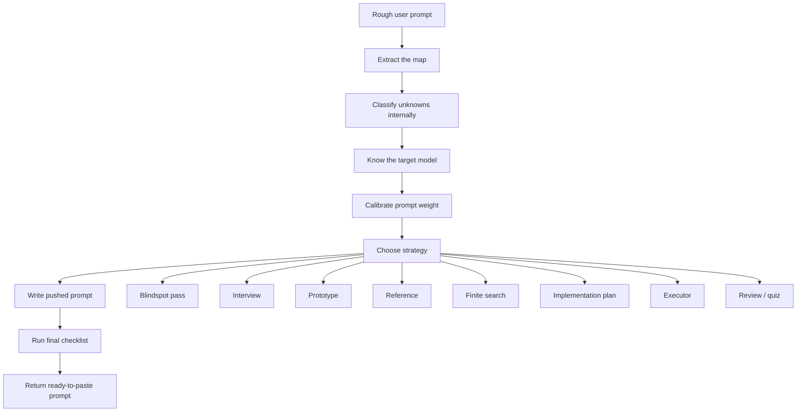

# Prompt Push: Finding Unknowns for Fable 5

This repository contains `prompt-push`, a Codex skill inspired by Thariq's X article, [A Field Guide to Fable: Finding Your Unknowns](https://x.com/trq212/article/2073100352921215386).

The article's central idea is simple and powerful: prompts are the map, real work is the territory, and the gap between them is made of unknowns. `prompt-push` turns that idea into a practical skill for rewriting rough user intent into a stronger prompt for another LLM or coding agent.

## What This Skill Does

`prompt-push` does not solve the user's task directly. It produces a better prompt for the next model.

Use it when you explicitly want to turn a rough prompt into a sharper, ready-to-paste prompt for an LLM or agent. The skill:

- extracts the actual goal, context, constraints, and target model
- classifies unknowns internally
- decides whether the next model should ask, explore, prototype, reference, proceed, or search finitely
- calibrates prompt size to task size
- produces a prompt with a clear working method, output format, and quality bar

## Why It Exists

Thariq's article frames agentic work around a recurring failure mode: the model is forced to make decisions inside gaps the user did not know to clarify.

Those gaps show up as:

- **Known knowns**: what the user already said
- **Known unknowns**: open questions the user can see
- **Unknown knowns**: taste, preferences, or standards the user may recognize only after seeing options
- **Unknown unknowns**: hidden constraints, risks, or better approaches the user has not considered

`prompt-push` helps the next model handle those gaps deliberately instead of guessing through them.

## Workflow



## Finite Search Behavior

For learning, explanation, comparison, "what is X", and source-sensitive information tasks, the skill pushes the receiving model to search deeply but finitely.

It should not ask for infinite search or "search until the bottom." Instead, it asks the model to:

- check a bounded set of high-quality sources
- prioritize primary, official, or original references
- continue only while new sources change the explanation
- stop when the definition, mechanism, disagreements, risks, and implications stabilize
- separate established facts from uncertainty
- list remaining unknowns

This makes the receiving model more curious without letting it browse forever.

## Install

Copy `SKILL.md` into your Codex skills directory:

```text
$CODEX_HOME/skills/prompt-push/SKILL.md
```

Then restart Codex so the skill metadata is loaded.

## Invocation

The skill is intentionally narrow-triggered. Invoke it explicitly:

```text
run $prompt-push:
Is this eval and memory layer built according to the latest AI advancements?
```

The output should be a better prompt for another model, not the answer to the question.

## Example Output Shape

By default, `prompt-push` returns:

1. **Diagnosis**: what the rough prompt lacks or risks
2. **Strategy**: the prompting strategy selected
3. **Pushed Prompt**: a ready-to-paste prompt
4. **Optional Additions**: extra context the user could provide

## Repository Contents

- `SKILL.md`: the Codex skill
- `README.md`: this overview and attribution

## Attribution

This repository is an independent skill package inspired by Thariq's public article on finding unknowns while working with Claude Fable 5:

[https://x.com/trq212/article/2073100352921215386](https://x.com/trq212/article/2073100352921215386)

It is not an official Anthropic, Claude, X, or Thariq project.
